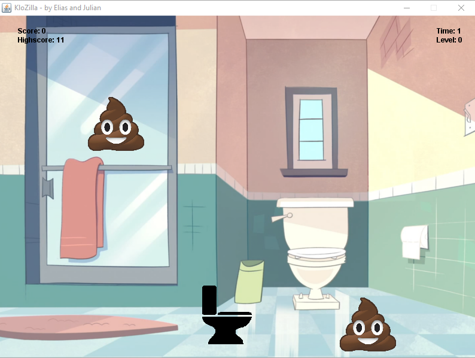

# KloZilla (February 2018)
This is our first game we programmed in Java.
<br>*by Julian Weber ([@juwbr](https://github.com/juwbr)) and Elias Theis ([@eliastheis](https://github.com/eliastheis))*

## How it works
The goal is to collect the shit falling from the sky.
If you don't collect the poop with the toilet, the poop level rises one step. The **plunger** lowers the mirror one step and the **toilet paper** raises the mirror one step. The **stopwatch** slows down the time for a moment. The **sponge** completely removes the poop level.

## Start your own adventure
Execute the main-method from ```/src/elias/julian/klozilla/main/Main.java```

## Screenshots





